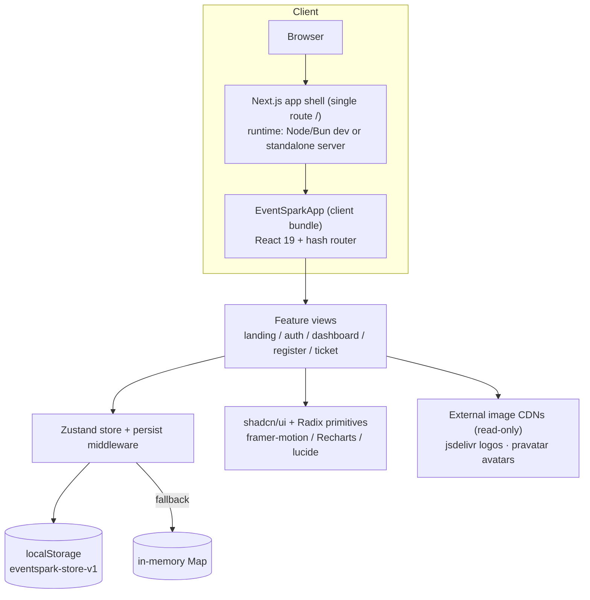

# Event Spark — Master Project Architecture Document (PAD) v1.0.0

**Classification:** Internal Engineering Reference
**Status:** DEFINITIVE, PRODUCTION-LOCKED BLUEPRINT
**Companion Document:** `README.md` (user-facing), `AGENTS.md` / `CLAUDE.md` (agent instructions)
**Last Updated:** 2026-09-14
**Audience:** Senior Engineers, Tech Leads, DevOps, and Onboarding Engineers
**Rule:** Every architectural decision in this document traces to a specific rationale. Nothing is here "because it's popular."

#### Revision Block — v1.0.0

- `[SYN]` Initial PAD generated from the delivered v1.0.0 codebase.
- `[SAN]` No secrets, credentials, or session artifacts are referenced in this document.

### Table of Contents

1. [System Overview & Decisions](#1-system-overview--decisions)
2. [High-Level System Topology](#2-high-level-system-topology)
3. [Application Architecture](#3-application-architecture)
4. [Data Architecture](#4-data-architecture)
5. [Design System Reference](#5-design-system-reference)
6. [Security Architecture](#6-security-architecture)
7. [Testing Strategy](#7-testing-strategy)
8. [Build & Deployment](#8-build--deployment)
9. [Developer Handbook](#9-developer-handbook)
10. [Known Issues & Outstanding Tasks](#10-known-issues--outstanding-tasks)
11. [Key Files Reference](#11-key-files-reference)
12. [Glossary](#12-glossary)

---

## 1. System Overview & Decisions

### 1.1 Document Metadata & Purpose

Event Spark is a self-contained event platform — a faithful rebuild of the *eventspark* Lovable template — where organizers create events, publish branded registration pages, manage attendees and check-ins, and read registration analytics, while attendees register without accounts and receive QR tickets. This PAD is the single source of truth for understanding, extending, debugging, or replicating the system. New engineers should read §1–§3 first; debuggers should start at §3.3 and §10; anyone reviewing technology choices should read §1.3 (ADRs) in full.

### 1.2 Technology Stack Summary

| Layer | Technology | Version | Key Rationale |
|-------|-----------|---------|---------------|
| Web framework | Next.js (App Router) | ^16.1.1 | Single-page shell with best-in-class DX (Turbopack), `next/font` self-hosting, first-class TS support |
| Language | TypeScript | 5.x, `strict` | Domain-model integrity across store, views, and seeds |
| Styling | Tailwind CSS | 4.x | CSS-first token authoring in `globals.css`; no JS config drift |
| UI primitives | shadcn/ui + Radix UI | dialog ^1.1.14 et al. | Accessible primitives (dialogs, tabs, switches) the reference design was built on |
| State management | Zustand | ^5.0.6 | Minimal store with `persist` middleware; avoids Redux ceremony for a local-first app |
| Charts | Recharts | ^2.15.4 | Declarative React charts matching the analytics mockups |
| Animation | framer-motion | ^12.23.2 | `whileInView` reveals and hero motion matching the original's feel |
| Utilities | date-fns | ^4.1.0 | Tree-shakable date formatting |
| Toasts | sonner | ^2.0.6 | Unobtrusive feedback layer |
| Icons | lucide-react | ^0.525.0 | Icon set used by the reference design |
| Fonts | Bricolage Grotesque + DM Sans | via `next/font/google` | Exact typefaces of the reference site, self-hosted to avoid runtime CDN dependency |
| Runtime / package manager | Bun | 1.3.x | Fast installs and dev server; single lockfile (`bun.lock`) |

### 1.3 Architecture Decision Records (ADRs)

**ADR-001: Rebuild the reference SPA as a Next.js single-route application**

- **Context:** The original eventspark is a Vite React SPA with React Router, Supabase auth, and a real backend. The rebuild must run in a sandbox that only exposes one route (`/`) and be deployable anywhere without API keys.
- **Decision:** Serve the entire product from one Next.js App Router page (`src/app/page.tsx`) that mounts a client-side SPA; implement navigation as a **hash router** (`#/dashboard/events`, `#/register/:slug`) in `src/lib/spa/router.tsx`.
- **Rationale:** Hash routing preserves deep links and back/forward semantics without server rewrite rules; a single Next.js route satisfies the hosting constraint while keeping Next.js tooling (fonts, metadata, Turbopack).
- **Consequences:** + Zero backend, works on any static-ish host. – No SSR per view (irrelevant for a local-state app); URL paths carry a `#` prefix.
- **Alternatives Rejected:** React Router inside Next (duplicate routing models, no gain); multiple Next routes (violates the single-route hosting constraint); Next.js middleware rewrites (needs server).

**ADR-002: Client-side persistence via a single persisted Zustand store**

- **Context:** The product needs accounts, events, registrations, and metrics to survive reloads, with zero infrastructure.
- **Decision:** One `useSparkStore` (Zustand) with `persist` middleware writing to `localStorage` key `eventspark-store-v1`, wrapped in a `safeStorage()` adapter that falls back to in-memory storage.
- **Rationale:** Zustand selectors give fine-grained re-renders; `persist` + `partialize` gives durable state with transient flags excluded; the storage wrapper prevents crashes in restricted browsing contexts.
- **Consequences:** + Instant onboarding, deterministic seeds. – Data is per-browser; no cross-device sync (acceptable for a template/demo); storage quota limits apply.
- **Alternatives Rejected:** IndexedDB (async ergonomics complicate hydration); Prisma/SQLite (requires a server); React Context (re-render and persistence awkwardness).

**ADR-003: Demo authentication with Web Crypto SHA-256 hashing**

- **Context:** Auth must exist to gate the dashboard without a real identity provider, and must not teach bad habits.
- **Decision:** Store users with `passwordHash = sha256Hex(password)` computed via the Web Crypto API; compare digests on sign-in; seed a demo organizer lazily on first load.
- **Rationale:** Avoids plaintext-at-rest in the demo while staying dependency-free; documented explicitly as *not* a production pattern (no salt, no KDF).
- **Consequences:** + No plaintext passwords in localStorage. – Unsalted SHA-256 is trivially brute-forceable; acceptable only because there is nothing valuable behind it.
- **Alternatives Rejected:** Plaintext storage (bad default); bcrypt/argon2 (adds native deps for a demo); real OAuth (needs providers).

**ADR-004: Design tokens as Tailwind v4 CSS-first variables**

- **Context:** The clone must reproduce the reference design's exact palette, radii, and typography, and both light/dark themes.
- **Decision:** Define all tokens in `src/app/globals.css` (`@theme inline` mapping + `:root`/`.dark` HSL values); map `--font-display`/`--font-sans` to `next/font` variables; keep `tailwind.config.ts` only as a legacy fallback.
- **Rationale:** One authoritative token source; dark mode works by class-swap without config duplication; HSL values were extracted verbatim from the reference site's stylesheet.
- **Consequences:** + Single place to theme. – Contributors familiar with JS config must learn the CSS-first syntax; editing the legacy config appears to work but does not affect utilities.
- **Alternatives Rejected:** JS-config tokens (Tailwind 4 canonical path is CSS-first); CSS-in-JS (runtime cost).

**ADR-005: Deterministic seed data with a seeded PRNG**

- **Context:** Hydration consistency: the server prerender and the client's first render must produce identical markup, and demo analytics must be stable.
- **Decision:** All seeds (events, registrations, 30-day metrics) derive from fixed dates and a `seededRandom(seed)` PRNG — never `Date.now()` or `Math.random()` at module scope.
- **Rationale:** Prevents React hydration mismatches and flaky visual snapshots; makes "Reset demo data" reproducible.
- **Consequences:** + No hydration warnings. – Demo data looks static across hard reloads (by design).
- **Alternatives Rejected:** `Math.random()` seeds (hydration mismatches); server-only seeding (no server).

**ADR-006: Restyled shadcn Button instead of a custom button system**

- **Context:** The reference design uses pill buttons everywhere, with a dark-ink default variant and specific hover physics (`hover:-translate-y-[1px]`, `active:scale-[0.97]`).
- **Decision:** Edit the shared `Button` cva (base `rounded-full`, variant `default = bg-foreground`, added `primary` variant) rather than creating per-feature buttons.
- **Rationale:** One component keeps motion/behavior consistent across 100+ usages; adding a variant is additive and reversible.
- **Consequences:** + Consistent interaction physics. – Deviates from stock shadcn (documented here).
- **Alternatives Rejected:** A parallel `PillButton` (duplication); utility-class overrides at each call site (drift).

---

## 2. High-Level System Topology



**Scaling characteristics:** the entire product is one client bundle plus static assets; there is no server state, so the only scaling axis is bundle size and CDN cache. The dev server compiles on demand (Turbopack); production runs as a standalone Next server or any static-capable host.

**Key constraints:** one externally exposed route; `localStorage` availability determines persistence vs memory fallback; external CDN images (integration logos, some avatars) require end-user internet access.

---

## 3. Application Architecture

### 3.1 The Layer Model

```
Layer 0: Next.js shell — layout.tsx (fonts, metadata, Toaster) + page.tsx.
         Rule: server components only; no product logic here.

Layer 1: SPA router — app.tsx route switch + lib/spa/router.tsx (hash).
         Rule: the ONLY place route strings are parsed; views never read location directly.

Layer 2: Feature views — components/spa/{landing,auth,dashboard,register,ticket}.
         Rule: compose UI, hold view-local state; no persistence, no domain math.

Layer 3: Domain layer — lib/spa/{types,store,seed,utils,copy}.
         Rule: single source of truth for models, state transitions, and helpers.

Layer 4: UI primitives — components/ui (shadcn/Radix) + logo/qr-code.
         Rule: presentation-only, no store imports.
```

**Golden rule:** dependencies point strictly downward. A layer never imports from a layer above it.

### 3.2 Annotated Directory Structure

```
event-spark/
├── src/
│   ├── app/
│   │   ├── globals.css        ← all design tokens, @theme inline, :root/.dark, keyframes
│   │   ├── layout.tsx         ← Bricolage+DM Sans via next/font; metadata; Sonner toaster
│   │   └── page.tsx           ← mounts <EventSparkApp/>; the only route
│   ├── components/
│   │   ├── spa/
│   │   │   ├── app.tsx        ← route switch, auth guard, demo-user bootstrap, 404
│   │   │   ├── logo.tsx       ← glyph + wordmark (3 sizes)
│   │   │   ├── qr-code.tsx    ← deterministic pseudo-QR SVG for tickets
│   │   │   ├── landing/       ← nav, hero (rotating word, floating cards, confetti),
│   │   │   │                     popular-events, features (bento), testimonials, final CTA+footer
│   │   │   ├── auth/          ← tabbed log-in/sign-up card + demo-credentials helper
│   │   │   ├── dashboard/     ← shell (sidebar/user), home, events, create (4-step),
│   │   │   │                     workspace (8 sections), attendees, analytics, integrations, settings
│   │   │   ├── register/      ← public event page: details + tier picker + registration form
│   │   │   └── ticket/        ← gradient ticket card + QR + attendee details
│   │   └── ui/                ← shadcn primitives; button.tsx restyled (pills, ink default)
│   └── lib/spa/
│       ├── types.ts           ← AppUser, EventItem, TicketTier, Registration, IntegrationState, DailyMetric
│       ├── store.ts           ← useSparkStore + persist + safeStorage + select* helpers
│       ├── seed.ts            ← demo organizer, 5 events, deterministic registrations & metrics
│       ├── copy.ts            ← landing copy constants (mirrors reference site)
│       ├── router.tsx         ← navigate(), useHashRoute(), routeSegments()
│       └── utils.ts           ← generateId, slugify, date formatting, sha256Hex, validators, seededRandom
├── prisma/                    ← scaffold Prisma schema (unused; kept for optional DB path)
├── public/images/             ← downloaded brand assets (logo glyph, 5 event covers, 3 avatars)
├── bun.lock                   ← pinned dependency graph
└── package.json               ← scripts: dev / build / start / lint / db:*
```

### 3.3 Critical Code Patterns

**Pattern 1 — Stable-reference Zustand selection (the app's #1 crash guard):**

```typescript
// selectors must return stable references; deriving inside the selector
// re-triggers React's snapshot comparison on every render → infinite loop.
const allRegistrations = useSparkStore((s) => s.registrations); // raw slice: stable
const rows = useMemo(                                          // derive outside
  () => allRegistrations.filter((r) => r.eventId === event.id),
  [allRegistrations, event.id]
);
```

*Why this pattern:* Zustand v5 uses `useSyncExternalStore`; a fresh array per call makes `getSnapshot` unstable and React throws "The result of getSnapshot should be cached to avoid an infinite loop". This exact crash shipped once and is now the canonical selection style (see ADR-002, §10).

**Pattern 2 — Hooks before early exits (register view):**

```typescript
const event = useMemo(() => events.find((e) => e.slug === slug), [events, slug]);
const soldByTier = useMemo(() => { /* guards internally for !event */ }, [registrations, event]);
const [tierId, setTierId] = useState<string | null>(null);
// ...all hooks registered...
if (!event) return <NotFound />;  // safe: hook order is now unconditional
```

*Why this pattern:* the "event not found" branch must not skip hook calls; ESLint's `rules-of-hooks` fails otherwise. The `soldByTier` memo tolerates a missing event instead of moving below the return.

**Pattern 3 — Action-result errors instead of exceptions:**

```typescript
signIn: async (email, password) => {
  const user = get().users.find((u) => u.email === normalized);
  if (!user) return { ok: false, error: "No account found with this email." };
  if ((await sha256Hex(password)) !== user.passwordHash)
    return { ok: false, error: "Incorrect password. Please try again." };
  set({ sessionEmail: user.email });
  return { ok: true };
};
```

*Why this pattern:* views render these messages inline with `role="alert"`; nothing throws across a render boundary, so the app never white-screens on bad input.

**Pattern 4 — Safe storage with graceful degradation:**

```typescript
function safeStorage(): Storage {
  try {
    /* probe localStorage with a write/remove round-trip */
    return window.localStorage;
  } catch {
    /* private mode / sandboxed iframe → in-memory Map shim */
  }
}
```

*Why this pattern:* direct `localStorage` access throws in restricted contexts; the store must persist when possible and silently degrade otherwise (ADR-002).

**Pattern 5 — Deterministic derivation for tickets:**

```typescript
// qr-code.tsx — the visual is a function of the registration id alone
let numericSeed = 0;
for (let i = 0; i < seed.length; i++)
  numericSeed = (numericSeed * 31 + seed.charCodeAt(i)) % 2147483647;
const rand = seededRandom(numericSeed || 1); // stable cells across renders/reloads
```

*Why this pattern:* tickets must be reproducible across reloads and identical on every render; a real QR encoder is a drop-in swap later (documented in the component header).

---

## 4. Data Architecture

### 4.1 Store Schema (localStorage `eventspark-store-v1`)

```mermaid
erDiagram
    APPUSER ||--o{ EVENTITEM : owns
    EVENTITEM ||--o{ TICKETTIER : "ticket_tiers[]"
    EVENTITEM ||--o{ REGISTRATION : receives
    TICKETTIER ||--o{ REGISTRATION : "tier_id"
    EVENTITEM ||--o{ REGISTRATIONFORMFIELD : "form_fields[]"

    APPUSER {
        string id PK
        string name
        string email UK
        string passwordHash "sha-256 hex, Web Crypto"
        string role "organizer|attendee"
        string createdAt ISO
    }
    EVENTITEM {
        string id PK
        string slug UK "name-random6"
        string name
        string tagline
        text description
        string category "Workshop|Social|Hackathon|Conference|Meetup"
        string date ISO
        string city
        boolean isRemote
        number price "0 = free"
        string imageUrl
        string accentColor "hex, ticket/branding gradient"
        number capacity
        string status "draft|published|archived"
        string ownerId FK
    }
    TICKETTIER {
        string id PK
        string name
        number price
        number quantity
        string description
    }
    REGISTRATION {
        string id PK "reg_xxxxxxxx"
        string eventId FK
        string attendeeName
        string attendeeEmail
        number quantity
        string tierId FK
        string status "confirmed|cancelled"
        boolean checkedIn
        string createdAt ISO
        string source "direct|social|search|referral"
    }
```

### 4.2 Persistence Strategy

- **Write path:** component action → store `set()` → `persist` middleware serializes the partialized state on every mutation.
- **Read path:** synchronous hydration at first client render; `authReady` gates the app until the async demo-user bootstrap completes (splash state prevents flicker).
- **Migration:** store `version: 1`; future shape changes bump the version and add a `migrate` function — never mutate persisted shape silently.
- **Reset:** `resetDemoData()` restores seeds for events/registrations/integrations/metrics while preserving accounts.

### 4.3 Derived Data

Counts (attendees per event, revenue, conversion) are never stored; they derive at read time from registrations + tiers, keeping one source of truth. Analytics series (30-day views/registrations) are seeded once and reset with demo data.

---

## 5. Design System Reference

### 5.1 Typographic System

| Role | Typeface | Weights | Usage |
|------|----------|---------|-------|
| Display | Bricolage Grotesque (`font-display`) | 400–800 | Headings, brand wordmark; `tracking-[-0.03em]`, tight leading (~0.95–1.05) |
| Body | DM Sans (`font-sans` default) | 400–700 | Paragraphs, UI labels, forms |

Both are self-hosted through `next/font/google` and exposed as `--font-bricolage` / `--font-dmsans` CSS variables.

### 5.2 Color Tokens (light / dark)

| Token | Light | Dark | Usage |
|-------|-------|------|-------|
| `--primary` | `hsl(340 75% 58%)` ≈ #E44479 | same | Brand pink: links, active nav, badges, CTA accents |
| `--background` | `hsl(0 0% 98%)` | `hsl(240 25% 8%)` | App background |
| `--foreground` | `hsl(240 30% 14%)` | `hsl(240 5% 95%)` | Ink; default Button bg in light mode |
| `--muted-foreground` | `hsl(240 5% 46%)` | `hsl(240 5% 55%)` | Secondary text |
| `--border` | `hsl(0 0% 91%)` | `hsl(240 15% 20%)` | Card/control borders |
| `--success` | `hsl(172 50% 40%)` | same | Confirmed / checked-in / "Live" |
| `--warning` | `hsl(38 80% 55%)` | same | Caution accents |
| `--destructive` | `hsl(0 84% 60%)` | `hsl(0 62% 30%)` | Destructive actions |

Base radius `--radius: 0.5rem` with the standard `sm/md/lg/xl` scale; feature cards intentionally overshoot to `rounded-[2rem]`/`rounded-[28px]` to match the reference.

### 5.3 Component Primitives

shadcn/ui (Radix) provides dialog, alert-dialog, tabs, switch, inputs, labels, textarea, sonner toasts. The **Button** cva is customized: pill base (`rounded-full`), hover lift `-translate-y-[1px]`, active press `scale-[0.97]`, `default` = ink, `primary` = brand pink, motion-reduce aware.

### 5.4 Motion / Animation

framer-motion drives hero entrance (staggered floating cards), `whileInView` section reveals (`opacity/y`, 0.4–0.55s, `ease [0.22, 1, 0.36, 1]`), and the rotating headline word (2.6s interval swap). CSS keyframes: `float` (cards), `word-rotate`, plus Tailwind's `animate-pulse` for "Live" indicators. `motion-reduce:transition-none` guards are built into the Button base.

---

## 6. Security Architecture

### 6.1 Security Rules

| Rule | Enforcement |
|------|-------------|
| No secrets in source or history | GitHub push protection on the remote; local habit: never paste credentials into files (this repo once required a `git filter-repo` purge for a leaked SSH key — see §10) |
| No plaintext passwords | `sha256Hex()` (Web Crypto) in `signUp`/`signIn`/seed builder; only digests persisted |
| Validate external input | All forms validate (email regex, length, consent checkbox) before store writes; store actions re-normalize (trim, lowercase emails) |
| XSS-safe rendering | React text nodes only; no `dangerouslySetInnerHTML` anywhere in `src/` |
| Least privilege | No network calls except read-only CDN images; no cookies; no tokens |
| Storage containment | All persistence via `safeStorage()`; storage failures degrade to memory, never crash |

### 6.2 Security Utilities

`sha256Hex` (`utils.ts`) — password digesting. `isValidEmail` — input validation. `safeStorage` (`store.ts`) — probing storage wrapper. `slugify` — generates URL-safe event slugs (input-restricted charset).

### 6.3 Authentication & Authorization

Demo model: accounts live in the store; the session is a `sessionEmail` string; the dashboard route guard in `app.tsx` redirects unauthenticated visitors to the auth view. Roles (`organizer`/`attendee`) exist on the model; the UI currently treats all accounts as organizers. **This is explicitly NOT a production auth design** — unsalted SHA-256, client-side session, no CSRF surface (no server). Replacing it is a contained change: swap `signIn`/`signUp` + the guard in `app.tsx`.

### 6.4 Threat Model

| Vector | Reality | Mitigation |
|--------|---------|------------|
| Credential theft | Digests only; brute-force of unsalted SHA-256 is trivial → acceptable because protected surface is local demo data | Documented; swap to real auth before any multi-user deployment |
| XSS | No HTML injection points | React escaping; no raw HTML APIs |
| localStorage tampering | User can edit their own store | Store actions validate on write; corrupted state fails closed (views guard missing entities) |
| Secret leakage via git | Once happened (see §10) | History was rewritten; push protection is the backstop; rule documented in CLAUDE.md |

---

## 7. Testing Strategy

### 7.1 Test Distribution

| Category | Files | Tests | Location | Framework |
|----------|-------|-------|----------|-----------|
| Automated | 0 | 0 | — | — (gap, see §10) |
| Manual golden path | 1 documented checklist | 6 steps | `CLAUDE.md` → Testing Strategy | Human/agent-in-browser |

### 7.2 Verification Practice (current)

`bun run lint` + `bunx tsc --noEmit` must be clean. The golden path (sign-in → overview → create event → publish → public registration → ticket → check-in) is exercised in a real browser (headless Chromium via agent-browser during development). All routes were also smoke-swept for console errors.

### 7.3 Pre-PR / Pre-Deploy Checklist

- [ ] `bun run lint` — zero errors
- [ ] `bunx tsc --noEmit` — zero errors
- [ ] Golden path walkthrough passes in a browser
- [ ] No new `any`, no console noise, no hydration warnings in the dev log
- [ ] Store selectors still return stable references (no `.filter()` inside selectors)
- [ ] `git log -p` reviewed for accidental secrets before push

---

## 8. Build & Deployment

### 8.1 Production Build

```bash
bun run build   # next build (Turbopack) → .next/standalone + static assets
bun run start   # serves the standalone build
```

The app is one client page plus static assets — any Node host or static-capable platform works. No environment variables are required at runtime.

### 8.2 Environment Variables

| Name | Required | Description | Default |
|------|----------|-------------|---------|
| `DATABASE_URL` | No | Prisma SQLite path — scaffold only, unused by the app | `file:./db/custom.db` |

### 8.3 CI/CD

No pipeline is configured in this repository. The recommended minimal gate when one is added: `bun install → bun run lint → bunx tsc --noEmit → bun run build`.

---

## 9. Developer Handbook

### 9.1 Local Setup

```bash
bun install
bun run dev          # http://localhost:3000
# optional scaffold DB (unused by the app): bun run db:push
```

Demo login: `demo@eventspark.app` / `SparkDemo2026!`.

### 9.2 Common Commands

| Command | Location | Purpose |
|---------|----------|---------|
| `bun run dev` | repo root | Dev server, port 3000 |
| `bun run lint` | repo root | ESLint gate |
| `bunx tsc --noEmit` | repo root | Type gate |
| `bun run build` / `start` | repo root | Production build / serve |

### 9.3 Code Style Rules

Enforced by ESLint (`eslint.config.mjs`, Next.js core-web-vitals + TS rules) and review: strict TS, no `any`, hooks order, stable store selectors, Conventional Commits, comments explain *why*.

### 9.4 Git Workflow

Short-lived `feat/*`/`fix/*`/`chore/*` branches merged to `main`; atomic Conventional Commits; **never force-push `main`**; if GitHub rejects a push with GH013 (secret detected), rewrite history (`git filter-repo --invert-paths`) — never "unblock" a live secret.

---

## 10. Known Issues & Outstanding Tasks

| Priority | Issue | Impact | Status |
|----------|-------|--------|--------|
| CRITICAL (process) | A private SSH key was accidentally committed by an automation snapshot; history was rewritten with `git filter-repo` before the first push | Remote history is clean; lesson encoded in CLAUDE.md/AGENTS.md | Resolved |
| HIGH | No automated test suite | Regressions rely on manual golden-path checks | Open — Vitest + Testing Library recommended; first targets: `utils.ts`, store actions |
| MEDIUM | Demo auth is unsalted SHA-256 with client-side sessions | Not production-usable auth | Open by design; swap path documented in §6.3 |
| MEDIUM | Ticket "QR" is decorative (deterministic pattern, not scannable) | Check-in demo accepts ticket IDs; real events need a real encoder | Open — swap `qr-code.tsx` |
| LOW | `prisma/` + `db:*` scripts are scaffold leftovers | Unused code/dependency in the repo | Open — remove or wire intentionally |
| LOW | External CDN images (jsdelivr, pravatar) for integration logos / extra avatars | Offline demos show image placeholders | Open — vendor the assets locally |
| LOW | React 19 + Next 16 dev overlay shows a stale-version badge in dev | Cosmetic, dev-only | No action |

---

## 11. Key Files Reference

| File | Lines (approx.) | Purpose |
|------|-------|---------|
| `src/app/globals.css` | ~200 | All design tokens, themes, keyframes — the theme source of truth |
| `src/app/layout.tsx` | ~60 | Fonts, metadata, toaster mount |
| `src/components/spa/app.tsx` | ~180 | Route switch, auth guard, demo bootstrap, 404 |
| `src/lib/spa/store.ts` | ~300 | The state core: actions, persistence, selectors |
| `src/lib/spa/types.ts` | ~140 | Every domain model |
| `src/lib/spa/seed.ts` | ~230 | Demo organizer, events, registrations, metrics |
| `src/lib/spa/router.tsx` | ~50 | Hash router primitives |
| `src/components/spa/landing/hero.tsx` | ~230 | Hero: rotating word, floating cards, confetti |
| `src/components/spa/landing/features.tsx` | ~330 | Bento feature grid with four mini-mockups |
| `src/components/spa/dashboard/event-workspace.tsx` | ~750 | Eight workspace sections (build/grow/configure) |
| `src/components/spa/dashboard/dashboard-shell.tsx` | ~300 | Sidebar, mobile drawer, user chip |
| `src/components/spa/register/register-view.tsx` | ~300 | Public registration page + form |
| `src/components/spa/ticket/ticket-view.tsx` | ~140 | Ticket rendering with QR |
| `src/components/ui/button.tsx` | ~60 | Pill button cva (ink default / pink primary) |

---

## 12. Glossary

| Term | Meaning |
|------|---------|
| **Hash route** | In-app navigation via the URL fragment (`#/dashboard/events`) — works without server rewrites |
| **Event workspace** | The per-event management surface, split into Build / Grow / Configure sections |
| **Tier** | A named price/quantity bucket within an event (e.g. "Early bird $25 ×80") |
| **Registration** | An attendee's confirmed order for an event (quantity, tier, source, check-in state) |
| **Ticket code** | The registration id rendered as a deterministic QR-style pattern; accepted by the check-in scanner |
| **Seed data** | Deterministic demo content (5 events, registrations, 30-day metrics) created on first load |
| **Safe storage** | localStorage wrapper that falls back to an in-memory Map when persistence is unavailable |
| **Lovable template** | The original event-spark-2.lovable.app product this codebase faithfully rebuilds |
