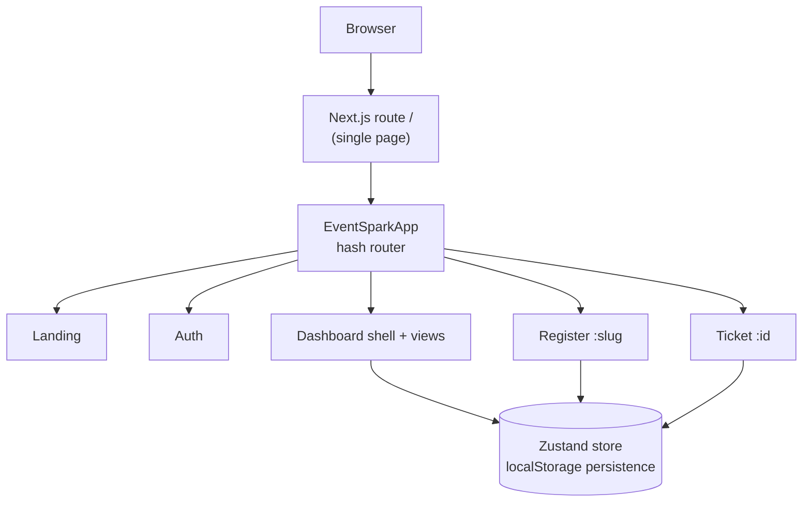

# Event Spark

    

**A self-contained event platform — branded registration pages, attendee tracking, tickets, and analytics, running entirely in the browser.**

## Overview

Event Spark is a pixel-faithful rebuild of the *eventspark* Lovable template, re-implemented as a production-grade Next.js application. Organizers create events through a guided four-step flow, publish branded registration pages, manage attendees and check-ins, and watch registration analytics — while attendees register without an account and receive a QR ticket. The problem it solves: spinning up a complete, working event platform demo without any backend, database, or API keys. Everything — accounts, events, registrations, metrics — persists locally via a typed Zustand store, so the whole product runs from a single `bun install`.

## Key Features

| Feature | What it does |
|---------|--------------|
| 🎯 Landing page | Hero with rotating headline, floating event cards, bento feature grid, testimonials — matching the original design system |
| 🔐 Demo auth | Sign up / log in with SHA-256-hashed passwords (Web Crypto); seeded demo account included |
| 📅 Event creation | Four-step wizard (Details → Tickets → Branding → Review) with validation, draft/publish states |
| 🏗️ Event workspace | Build (overview, landing page, tickets, branding) · Grow (promotion, attendees, check-in scanner) · Configure (settings) |
| 🎟️ Public registration | Tiered tickets with live spots-left counts, privacy consent, form validation |
| 📱 QR tickets | Deterministic per-registration ticket page with gradient branding and check-in code |
| 📊 Analytics | KPI cards plus Recharts area/donut/bar visualizations of views, conversions, and sources |
| 👥 Attendee management | Searchable roster across events, CSV export, one-click check-in toggles |
| 🔌 Integrations | Six integration cards (Slack, Zoom, HubSpot, Mailchimp, Google Calendar, Stripe) with simulated connect state |

## Architecture

| Layer | Technology | Version | Purpose |
|-------|-----------|---------|---------|
| Framework | Next.js (App Router) | 16.1.x | Single-route shell, Turbopack dev server |
| Language | TypeScript | 5.x (strict) | Typed domain models and store |
| Styling | Tailwind CSS | 4.x | CSS-first tokens in `globals.css` (`@theme inline`) |
| UI components | shadcn/ui + Radix | latest | Dialogs, tabs, switches, toasts |
| State | Zustand (persist) | 5.x | `eventspark-store-v1` in localStorage |
| Charts | Recharts | 2.15.x | Analytics visualizations |
| Motion | framer-motion | 12.x | Section reveals, hero animation |
| Icons | lucide-react | 0.525.x | Icon set |
| Runtime | Bun | 1.x | Package manager and dev server |



## File Hierarchy

```
📂 src/
 └── 📂 app/                    # Next.js App Router entry
     ├── 📄 layout.tsx          # Fonts (Bricolage Grotesque, DM Sans), metadata
     ├── 📄 page.tsx            # Renders the SPA (only route)
     └── 📄 globals.css         # Design tokens, light/dark themes, keyframes
📂 src/
 ├── 📂 components/spa/         # All product UI
 │   ├── 📄 app.tsx             # Route switch + auth guard
 │   ├── 📄 logo.tsx            # eventspark wordmark
 │   ├── 📄 qr-code.tsx         # Deterministic ticket QR visual
 │   ├── 📂 landing/            # Hero, nav, events, features, testimonials, CTA, footer
 │   ├── 📂 auth/               # Log in / Sign up view
 │   ├── 📂 dashboard/          # Shell + 8 views + event workspace
 │   ├── 📂 register/           # Public registration page
 │   └── 📂 ticket/             # Ticket view
 ├── 📂 components/ui/          # shadcn/ui primitives (Button restyled to pills)
 └── 📂 lib/spa/                # Domain layer
     ├── 📄 types.ts            # EventItem, Registration, AppUser, tiers, metrics
     ├── 📄 store.ts            # Zustand store + persist + selectors
     ├── 📄 seed.ts             # Demo events, registrations, 30-day metrics
     ├── 📄 copy.ts             # Landing page copy constants
     ├── 📄 router.tsx          # Hash router (navigate, useHashRoute)
     └── 📄 utils.ts            # slugify, formatDate, sha256Hex, validators
```

## Quick Start

Requires **Bun ≥ 1.1** (or Node ≥ 20 with npm — swap `bun` for `npm` in the commands below).

1. Install dependencies:

   ```bash
   bun install
   ```

2. Start the dev server:

   ```bash
   bun run dev
   ```

3. Open <http://localhost:3000>.

**Verify setup:** the landing page shows the rotating headline ("The event platform where ideas become events./experiences./communities./connections.") and four event cards.

**Demo account** (or create your own via Sign up):

```text
email:    demo@eventspark.app
password: SparkDemo2026!
```

**Golden path walkthrough:** sign in → *Overview* → *Events* → open **AI hackathon** → *Grow → Check-in scanner* → back to *Events* → **Public page** → register → receive QR ticket. Reset everything anytime from *Settings → Reset demo data*.

### Commands

| Command | Purpose |
|---------|---------|
| `bun run dev` | Dev server on port 3000 (Turbopack) |
| `bun run lint` | ESLint across the project |
| `bun run build` | Production build |
| `bun run start` | Serve the production build |

## Design System

| Token | Value | Usage |
|-------|-------|-------|
| `--primary` | `hsl(340 75% 58%)` ≈ `#E44479` | Brand pink — CTAs, links, active states |
| `--background` | `hsl(0 0% 98%)` | App background (light) |
| `--foreground` | `hsl(240 30% 14%)` | Ink (light) — also the default Button background |
| `--success` | `hsl(172 50% 40%)` | Confirmed / checked-in states |
| `--radius` | `0.5rem` | Base radius scale |

**Typography:** *Bricolage Grotesque* (display, `font-display` utility — headings, tracking `-0.03em`) and *DM Sans* (body, default sans). Both self-hosted via `next/font`.

**Buttons:** all buttons are pills (`rounded-full`); the default variant is dark ink (`bg-foreground`), the `primary` variant is brand pink.

## Troubleshooting

| Issue | Fix |
|-------|-----|
| Styles look wrong after switching branches / editing `globals.css` | Turbopack's persistent cache can serve stale CSS. Delete `.next/` and restart `bun run dev`. |
| Infinite render loop / "getSnapshot should be cached" crash | A Zustand selector is returning a fresh object/array per call. Select the raw slice (`s.registrations`) and filter with `useMemo` in the component instead. |
| Dev server exits when launched from a script | Launch with a double-fork daemonizer (`( setsid bash -c 'exec bun run dev' & )`) so it detaches from the parent session. |
| `localStorage` unavailable (private mode / iframe) | The store degrades to in-memory storage automatically — data won't persist across reloads. |

## License

No license file is present in this repository; all rights are reserved by the repository owner.
